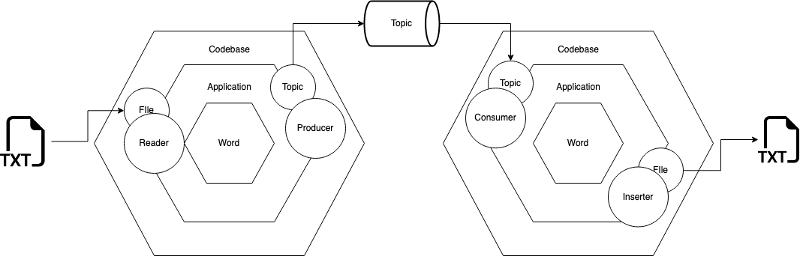
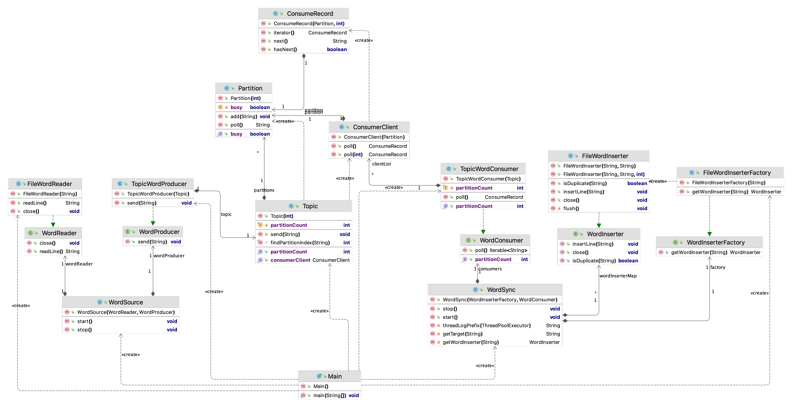
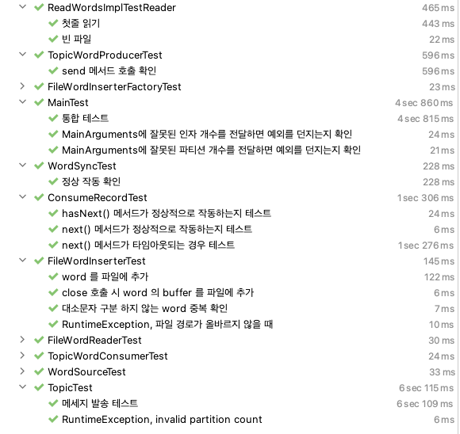
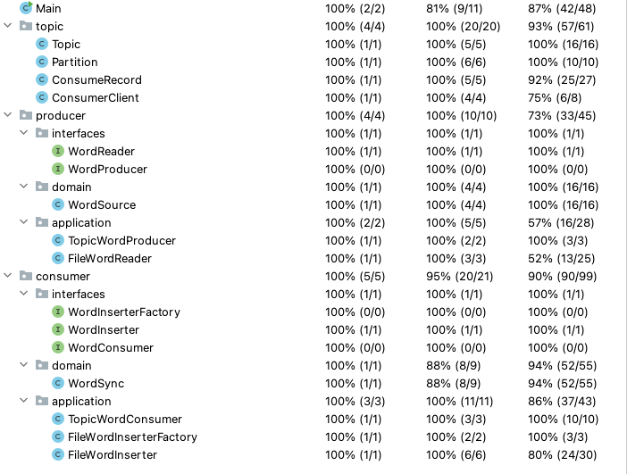

# 데이터플랫폼 사전과제

- Java 11
- Maven 3.6.3

## 1. Getting Started
프로젝트의 words.TXT 를 읽어서, 5개 파티션을 이용하여 result 에 적재하는 명령
```cmd
./mvnw compile

mkdir result

./mvnw exec:java \
  -Dexec.mainClass="com.ppojin.kafka.Main" \
  -Dexec.args="$(pwd)/words.TXT $(pwd)/result 5"
```

결과 초기화
```cmd
./mvnw clean
rm -rf kakaoWords.log result
```

---

## 2. 아키텍쳐



- Hexagonal 구조를 지향하며 과제를 작성함

### 2.1. 헥사고날 아키텍처 채택 이유
- Consumer 와 Producer 가 각각 분리될 것을 가정했을 때 헥사고날 아키텍처가 가장 적합하다고 생각했기 때문
- Port 와 Adapter 를 통해 데이터 관리주체와의 연결을 유연하게 관리할 수 있기 때문

### 2.2. 패키지 구조

- `*.domain` 패키지에서는 비즈니스와 관련된 기능만 수행하도록 구현함
- `*.interface` 패키지에서는 도메인에 필요한 비즈니스를 위한 api 를 정의함
- `*.application` 패키지에서는 domain 패키지에서 위임된 데이터 통신 기능만 수행하도록 구현함
- `com.ppojin.kafka.topic` 패키지에 consumer 와 producer 가 word 를 주고받을 객체를 구현함

### 2.3. 클래스 구조

#### 2.3.1. 네이밍 룰

- `*.domain` 패키지 내부의 객체는 도메인에 관한 이름으로 자유롭게 작성함
  - 도메인은 word 로 정하고 `kafka-connect` 의 비즈니스를 참고하여 작성함
- `*.interfaces` 패키지 내부의 객체는 비즈니스를 객체명 작성에 이용함
- `*.application` 패키지 내부의 객체는 `*.interfaces` 패키지의 Interface 를 impliment 하여 객체명의 prefix 를 데이터 주체의 이름으로 고정함
- `com.ppojin.kafka.topic` 내부의 객체는 `Kafka` 의 비즈니스와 인터페이스를 참고하여 작성함

#### 2.3.2. 클래스 UML




---

## 3. 주요 고려사항

### 3.1. Consumer 와 Producer 의 분리를 가정한 설계

- Main 함수는 각 패키지의 주요 클래스를 선언/실행하는 역할만 하도록 구현함
- Consuming 시점이 produce 시점보다 빠를 수 있기 때문에 현 과제의 메인 로직에서는 Consumer 와 Producer 가 함께 실행되도록 구현함
- Consumer 에 Timeout 값을 부여하는 것으로 추후 서비스 분리 시점에 추가 구현을 통해 Timeout 의 시간을 수정하거나 Inifinit loop 로 수정하기 용이하도록 구현함
- 데이터를 주고받을 주체는 별도로 구성해야 한다고 판단하였고, 해당 객체의 명칭은 Topic 으로 정의함
  - 분리된 이후에는 토픽 객체는 쓰이지 않게 될 것으로 가정하여 구현함
  - 토픽 객체를 연결정보에 접목하여 main 에서 선언한 Topic 을 각 Consumer 와 Producer 에 전달되도록 구현함

### 3.2. 파티션 적재기준

- word 의 파티션을 할당하는 객체는 파티션과 데이터의 관리 주체인 토픽으로 지정함
- 문자열의 해쉬값을 이용하여 파티션을 할당함
- 첫 문자를 파티션 선택의 기준으로 사용하지 않은 이유
  - 제공받은 `words.txt` 파일은 첫 문자 기준으로 몰려있어 파티션마다 적재시점이 각각 다른 시점에 몰릴 것으로 확인됨
  - A~Z 까지의 각 영어 문자들은 등장 빈도의 편차가 크기 때문에
    상대적으로 파티션 별 적재되는 데이터의 양이 균등하지 않을 것으로 생각함 ([참고문헌](https://en.wikipedia.org/wiki/Letter_frequency#Relative_frequencies_of_the_first_letters_of_a_word_in_English_language))
### 3.4. 중복 제거

- 각 파일을 관리하는 Inserter 들이 각각 Set 객체를 이용하여 캐싱하여 중복 입력 방지
- consume 한 word 의 upperCase 한 값을 Set 객체에 중복되는 값이 있는지 확인
  - 중복되는 값이 있다면 파일에 적재, 없다면 다음 word로 넘어감
- 중복값들을 관리하는 Set 객체를 결과 파일을 이용하여 initialize 하는 로직은 현재 요구사항에는 필요하지 않을 것으로 판단함

### 3.5. Argument 제한기준

- Main 객체에서는 Argument 개수가 3개인지와 파티션 개수에 대한 제한사항만 검토
- 파일과 파일경로에 대한 검증은 Consumer와 Producer가 분리될것을 가정하여 각 객체에 위임함

### 3.x. 기타

- word 를 txt 파일에 입력하는 시점에만 lock 적용하여, 한 쓰레드가 파일에 word 를 입력중이라면, 다른 쓰레드가 파일 객체의 입력 명령에 접근할 수 없도록 제한함

---

## 4. 최종 테스트 결과
실행결과는 본 프로젝트의 `./result.zip` 파일로 압축해두었습니다.

### 4.1. testCase


### 4.2. testCoverage
